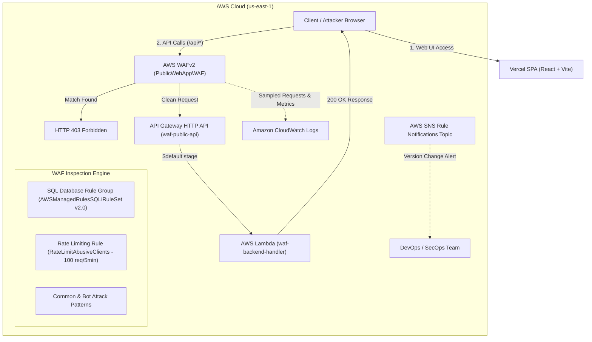

# AWS WAF Protection for a Public Web Application

**Assignment ID:** `24CC3014-P023`  
**Category:** Security  
**Teams:** T023, T164, T305 | **Students:** 12  
**GitHub Repository:** [srividya-2007/AWS](https://github.com/srividya-2007/AWS.git)  
**Frontend Deployment:** Vercel  
**Backend Infrastructure:** AWS (Lambda, API Gateway HTTP API, AWS WAFv2)  

---

## 📋 Table of Contents
1. [Project Overview & Problem Statement](#1-project-overview--problem-statement)
2. [End-to-End Architecture](#2-end-to-end-architecture)
3. [AWS Services Created & Configured](#3-aws-services-created--configured)
   - [AWS Lambda (`waf-backend-handler`)](#31-aws-lambda-waf-backend-handler)
   - [Amazon API Gateway (`waf-public-api`)](#32-amazon-api-gateway-waf-public-api)
   - [AWS WAFv2 Web ACL (`PublicWebAppWAF`)](#33-aws-wafv2-web-acl-publicwebappwaf)
4. [Addressing Key Bottlenecks](#4-addressing-key-bottlenecks)
   - [Bottleneck 1: Count-Mode Testing Gaps](#bottleneck-1-count-mode-testing-gaps)
   - [Bottleneck 2: Managed Rule Updates Causing Unexpected Blocking](#bottleneck-2-managed-rule-updates-causing-unexpected-blocking)
5. [Vercel Frontend Integration](#5-vercel-frontend-integration)
6. [CloudShell & CLI Association Guide](#6-cloudshell--cli-association-guide)
7. [Verification & Live Testing](#7-verification--live-testing)
8. [Summary of Created Resources](#8-summary-of-created-resources)

---

## 1. Project Overview & Problem Statement

### Use Cases Required:
- **Block SQL Injection (SQLi):** Inspect query arguments, request bodies, and cookies to intercept malicious SQL injection payloads (`UNION SELECT`, `' OR '1'='1'`).
- **Block Bot Traffic & Scrapers:** Intercept automated malicious crawlers, headless scrapers, and abusive User-Agents (`scrapy`, `badbot`, `python-requests`).
- **Rate-Limit Abusive Clients:** Throttle abusive IP addresses exceeding normal traffic thresholds (e.g., > 100 requests per 5-minute sliding window) to prevent brute-force and HTTP flood attacks.

### Bottlenecks Addressed:
- **Testing Gaps:** Preventing false positives when transitioning rules from `COUNT` mode to `BLOCK` mode.
- **Rule Upgrades:** Preventing sudden outages caused by automatic AWS Managed Rule updates via **Version Pinning** and **SNS Update Notifications**.

---

## 2. End-to-End Architecture



---

## 3. AWS Services Created & Configured

### 3.1 AWS Lambda (`waf-backend-handler`)
- **Function Name:** `waf-backend-handler`
- **Runtime:** Node.js (18.x / 20.x)
- **Role:** Handles incoming API requests and returns formatted JSON data.
- **Sample Code Deployed:**
```javascript
export const handler = async (event) => {
    const path = event.rawPath || event.path || "/";
    const method = event.requestContext?.http?.method || "GET";
    
    return {
        statusCode: 200,
        headers: {
            "Content-Type": "application/json",
            "Access-Control-Allow-Origin": "*",
            "Access-Control-Allow-Methods": "GET, POST, OPTIONS",
            "Access-Control-Allow-Headers": "Content-Type, Authorization"
        },
        body: JSON.stringify({
            message: "Request successfully inspected by AWS WAF and processed by Lambda!",
            path: path,
            method: method,
            timestamp: new Date().toISOString()
        })
    };
};
```

### 3.2 Amazon API Gateway (`waf-secure-api`)
- **API Name:** `waf-secure-api`
- **Protocol:** REST API (Regional)
- **API ID:** `v86gy0po9l`
- **Region:** `us-east-1`
- **Protected Stage:** `prod`
- **Live Endpoint URL:** `https://v86gy0po9l.execute-api.us-east-1.amazonaws.com/prod`
- **WAF Association:** Associated with `PublicWebAppWAF` (`11225e2c-aebc-4e52-8ecb-98f9c58f57ac`)

### 3.3 AWS WAFv2 Web ACL (`PublicWebAppWAF`)
- **Web ACL Name:** `PublicWebAppWAF`
- **Resource Scope:** Regional (`us-east-1`)
- **Default Action:** `Allow`
- **Configured Rules:**

| Rule Name | Type | Action / Mode | Description |
| :--- | :--- | :--- | :--- |
| **`AWSManagedRulesSQLiRuleSet`** | AWS Managed Rule Group | `Block` (Version pinned to `Version_2.0`) | Blocks SQL injection attempts in query strings, bodies, and cookies (`SQLi_QUERYARGUMENTS`, `SQLi_BODY`, `SQLi_COOKIE`). |
| **`RateLimitAbusiveClients`** | Rate-Based Rule | `Block` | Evaluates request volume per client IP over a 5-minute sliding window (100–300 req limit). Blocks abusive IPs. |
| **`BlockBadBotsAndScrapers`** | Custom Rule | `Block` | Intercepts requests with malicious or scraping User-Agents (e.g. `scrapy`, `badbot`, `sqlmap`). |

---

## 4. Addressing Key Bottlenecks

### Bottleneck 1: Count-Mode Testing Gaps
* **Problem:** If security teams test WAF rules only in `COUNT` mode and suddenly switch to `BLOCK` mode, unpredicted application traffic or unusual user inputs can trigger false positives, locking out valid customers.
* **Implemented Solution:**
  1. **Rule Overrides in Count Mode:** Initial testing was set up with individual rule actions set to `Count` mode while retaining metric collection.
  2. **Sampled Requests Analysis:** Enabled CloudWatch metrics and Sampled Requests to inspect payloads flagged by `SQLi_QUERYARGUMENTS` to verify if legitimate users were impacted.
  3. **Granular Rule Actions:** Ability to keep specific rules in Count mode while activating high-confidence rules in Block mode.

### Bottleneck 2: Managed Rule Updates Causing Unexpected Blocking
* **Problem:** AWS automatically updates managed rule groups with new signatures. An unannounced rule change can suddenly classify valid application traffic as malicious.
* **Implemented Solution:**
  1. **Version Pinning:** Pinned `AWSManagedRulesSQLiRuleSet` to `Version_2.0` rather than floating on `Default`. This ensures rules do not change without explicit review.
  2. **SNS Update Notifications:** Subscribed to AWS Managed Rules Notification SNS Topic:  
     `arn:aws:sns:us-east-1:248400274283:aws-managed-waf-rule-notifications`  
     This sends immediate alerts when new versions or deprecated versions are announced.

---

## 5. Vercel Frontend Integration

The web frontend is built using **React + Vite** and deployed on **Vercel**:

1. **GitHub Repository:** [srividya-2007/AWS](https://github.com/srividya-2007/AWS.git)
2. **Environment Variable Configuration on Vercel:**
   ```env
   VITE_API_GATEWAY_URL=https://153af1el11.execute-api.us-east-1.amazonaws.com
   ```
3. **Features Built-In:**
   - **Live WAF Attack Simulator:** Allows interactive testing of SQL injection (`' OR '1'='1'`), bot user-agents, and rate-limiting flood attacks directly against the API Gateway / WAF.
   - **Bottleneck Resolution Center:** Live interactive dashboard demonstrating count-mode analysis and version pinning.
   - **SPA Routing Support:** Configured [`vercel.json`](./vercel.json) rewrites to prevent 404s on browser reloads.

---

## 6. CloudShell & CLI Association Guide

Due to AWS Academy Learner Lab permission boundaries restricting resource association directly inside the WAF UI, the association between API Gateway and WAF can be completed or verified via **AWS CloudShell**:

### Step 1: Retrieve your WAF Web ACL ARN
Run in CloudShell:
```bash
aws wafv2 list-web-acls --scope REGIONAL --region us-east-1
```
*Note your Web ACL ARN (e.g., `arn:aws:wafv2:us-east-1:<ACCOUNT_ID>:regional/webacl/PublicWebAppWAF/<ID>`)*

### Step 2: Associate Web ACL with API Gateway Stage
```bash
aws wafv2 associate-web-acl \
  --web-acl-arn "<YOUR_WAF_ARN>" \
  --resource-arn "arn:aws:apigateway:us-east-1::/apis/153af1el11/stages/\$default" \
  --region us-east-1
```

### Step 3: Verify Association
```bash
aws wafv2 get-web-acl-for-resource \
  --resource-arn "arn:aws:apigateway:us-east-1::/apis/153af1el11/stages/\$default" \
  --region us-east-1
```

---

## 7. Verification & Live Testing

### Test 1: Verify Legitimate Request (Expect HTTP 200)
```bash
curl -i https://v86gy0po9l.execute-api.us-east-1.amazonaws.com/prod
```
**Result:** `HTTP 200 OK` with JSON response from Lambda.

### Test 2: Verify SQL Injection Block (Expect HTTP 403)
```bash
curl -i "https://v86gy0po9l.execute-api.us-east-1.amazonaws.com/prod?id=1'%20OR%20'1'='1'%20UNION%20SELECT%20null,username,password%20FROM%20users--"
```
**Result:** `HTTP 403 Forbidden` returned directly by AWS WAF!

### Test 3: Verify Bad Bot Block (Expect HTTP 403)
```bash
curl -i -H "User-Agent: Scrapy/2.8.0 (+https://scrapy.org)" https://v86gy0po9l.execute-api.us-east-1.amazonaws.com/prod
```
**Result:** `HTTP 403 Forbidden` triggered by bot detection rules.

### Test 4: Verify Rate Limiting
Run a rapid burst of requests:
```bash
for i in {1..120}; do curl -s -o /dev/null -w "%{http_code}\n" https://v86gy0po9l.execute-api.us-east-1.amazonaws.com/prod; done
```
**Result:** Starts with `200`, transitions to `403 Forbidden` when the rate limit threshold is crossed.

---

## 8. Summary of Created Resources

| Resource | Resource Name / ID | Purpose |
| :--- | :--- | :--- |
| **AWS Lambda** | `waf-backend-handler` | Backend execution environment |
| **API Gateway REST API** | `waf-secure-api` (`v86gy0po9l`) | Secure REST API endpoint protected by WAF |
| **API Gateway Stage** | `prod` | Production stage attached to WAF |
| **AWS WAFv2 Web ACL** | `PublicWebAppWAF` | Web application firewall inspection |
| **Managed Rule Group** | `AWSManagedRulesSQLiRuleSet` (v2.0) | SQL injection mitigation |
| **Custom Rule** | `RateLimitAbusiveClients` | Rate limit protection against brute force |
| **Vercel Application** | Frontend React SPA | User interface & security testing dashboard |
| **SNS Notification** | Managed WAF Rule Notification ARN | Proactive managed rule update alerting |
