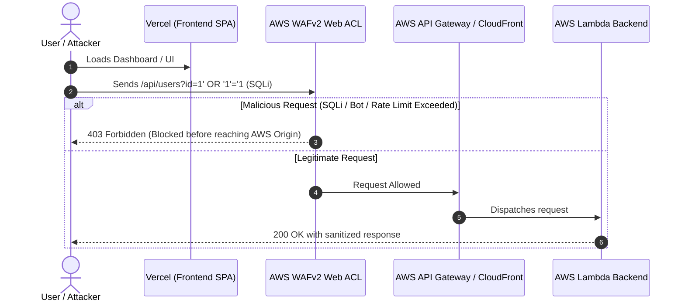

# Deploying to Vercel and Connecting to AWS Services

This guide explains how to deploy your frontend to **Vercel** and connect it to your **AWS WAF & Backend services** according to problem statement **24CC3014-P023**.

---

## Architecture Flow



---

## Phase 1: Deploy the Frontend to Vercel

### Option 1: Deploy using GitHub (Easiest)
1. Push your repository to GitHub:
   ```bash
   git add .
   git commit -m "feat: configure Vercel and AWS WAF integration"
   git push origin main
   ```
2. Go to [https://vercel.com](https://vercel.com) and log in.
3. Click **Add New...** -> **Project**.
4. Import your GitHub repository (`AWS`).
5. In **Build and Output Settings**:
   - Framework Preset: **Vite**
   - Root Directory: `./`
   - Build Command: `npm run build`
   - Output Directory: `dist`
6. Click **Deploy**.
   - Note: The included [`vercel.json`](file:///c:/Users/lanka_lc39l1s/OneDrive%20-%20K%20L%20University/Documents/AWS/vercel.json) ensures React Router works properly without 404 errors on sub-routes.

### Option 2: Deploy using Vercel CLI
If you have Vercel CLI installed:
```bash
npm i -g vercel
vercel
```
Follow the terminal prompts, and your site will be live instantly!

---

## Phase 2: Create AWS Services

You need two core backend components in AWS:
1. **The Backend API** (API Gateway + Lambda function).
2. **The AWS WAFv2 Web ACL** protecting that API with the 3 problem statement rules:
   - SQL Injection Rule
   - Bad Bot & Scraper Rule
   - Rate-Limiting Rule

You can create these either using the automated **Terraform** scripts already included in this repository, or through the **AWS Management Console (GUI)**.

### Method A: Automated via Terraform (Recommended)
1. Open terminal and navigate to the `terraform/` folder:
   ```bash
   cd terraform
   terraform init
   terraform apply
   ```
2. When prompted, type `yes`.
3. Terraform will provision:
   - AWS Lambda backend API (`terraform/lambda/index.js`)
   - Amazon API Gateway HTTP API
   - AWS WAFv2 Web ACL with SQLi (version pinned v2.0), Bot filtering, and Rate-limiting
   - CloudFront distribution fronting the API with WAF attached
4. Copy the output `cloudfront_url` or `api_gateway_url`.

---

### Method B: Manual via AWS Console GUI (Step-by-Step)

#### Step 1: Create the Backend Lambda Function
1. Go to the [AWS Lambda Console](https://console.aws.amazon.com/lambda/) in region `us-east-1`.
2. Click **Create function** -> **Author from scratch**.
3. Name: `waf-backend-api`, Runtime: **Node.js 20.x**.
4. In the code editor, copy and paste the contents of [`terraform/lambda/index.js`](file:///c:/Users/lanka_lc39l1s/OneDrive%20-%20K%20L%20University/Documents/AWS/terraform/lambda/index.js).
5. Click **Deploy**.

#### Step 2: Create API Gateway HTTP API
1. Go to [Amazon API Gateway](https://console.aws.amazon.com/apigateway/).
2. Choose **HTTP API** -> Click **Build**.
3. Add Integration: Select **Lambda** -> Choose `waf-backend-api`.
4. API Name: `waf-public-api`.
5. Configure routes:
   - Method: `ANY`, Resource path: `/api/{proxy+}`
   - Method: `ANY`, Resource path: `/api`
6. Finish creation. Under **CORS**, enable CORS and allow Origin `*` (or your Vercel domain).
7. Copy the **Invoke URL** (e.g. `https://abc123xyz.execute-api.us-east-1.amazonaws.com`).

#### Step 3: Create the AWS WAF Web ACL
1. Open the [AWS WAF Console](https://console.aws.amazon.com/wafv2/).
2. Select Region: **Global (CloudFront)** if fronting with CloudFront, or **US East (N. Virginia)** if using Regional resources.
3. Click **Create web ACL**.
4. Name: `PublicWebAppWAF`.
5. Under **Add rules and rule groups**:
   - **Rule 1 (SQL Injection):** Click *Add managed rule groups* -> Expand *AWS managed rule groups* -> Add **SQL database** (`AWSManagedRulesSQLiRuleSet`). Set version to `Version_2.0` (Pinned).
   - **Rule 2 (Bot Traffic):** Click *Add managed rule groups* -> Add **Core rule set** (`AWSManagedRulesCommonRuleSet`) or create custom rule matching `User-Agent` contains `scrapy`, `badbot`.
   - **Rule 3 (Rate Limiting):** Click *Add my own rules* -> Rule type: **Rate-based rule**. Threshold: `100` requests per 5 minutes per IP. Action: **Block**.
6. Set Default action to **Allow**.
7. Complete creation. Associate this Web ACL with your CloudFront distribution or API.

---

## Phase 3: Connect Vercel Frontend to AWS Services

Now connect your live Vercel app to your AWS endpoint:

1. Open your project on the [Vercel Dashboard](https://vercel.com).
2. Go to **Settings** -> **Environment Variables**.
3. Add the following variables:
   - **Key:** `VITE_API_URL`
   - **Value:** `https://your-aws-endpoint.amazonaws.com` *(Replace with your API Gateway or CloudFront URL)*
   - **Key:** `VITE_AWS_REGION`
   - **Value:** `us-east-1`
4. Click **Save**.
5. Go to the **Deployments** tab, click the three dots (`...`) on your latest deployment, and select **Redeploy**.

---

## Phase 4: Test and Verify the Integration

1. Open your live Vercel web app (`https://your-project.vercel.app/security-demo`).
2. Click on the **⚡ Live WAF Tester** tab.
3. Your AWS API URL will be automatically populated from `VITE_API_URL`.
4. Click **🚀 Execute Test** for:
   - **SQL Injection:** Fires `UNION SELECT` query. AWS WAF will block it with **HTTP 403 Forbidden**.
   - **Bot Traffic:** Fires request with scraper User-Agent. AWS WAF will block it with **HTTP 403 Forbidden**.
   - **Rate Limiter Burst:** Fires rapid bursts of requests to `/api/login`. Watch the WAF rate limiter automatically kick in and block excessive traffic!
